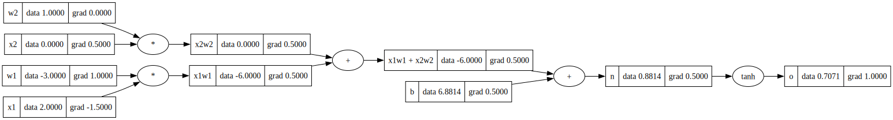

# micrograd

---

## Overview

I developed this repo by following Andrej Karpathy's brilliant [YouTube tutorial](https://www.youtube.com/watch?v=VMj-3S1tku0). This was a pedagogical exercise for me to grow a both intuitive and literal understanding of backpropogation over neural networks via hands-on exercise.

---

## Architecture

### `micrograd/engine.py`

`engine.py` defines a **Value** class, which is a wrapper object for scalar values that stores gradient information to efficiently calculate the partial derivative of the loss function with respect to a given Value object in the backward pass.

Gradient information is found by maintaining a logical DAG of Value objects and iteratively taking local partial derivatives (which is the heart of backprop). This DAG can be visualized by calling `DAGviz.draw_dot(x)`, for `x` a Value object.

### `micrograd/nn.py`

`nn.py` builds out a hierarchical **MLP** class by first implementing Neuron and Layer objects.

- **Neurons** store an array of weight Values and a single bias Value as well as an activation function, which are together used to map a vector of input Values to a single output value.
- **Layers** are therefore arrays of Neurons, and an MLP object aggregates Layers in an array and exports additional functionality, like the forward pass.

---

This minimal neural network library is nonetheless capable of e.g. complex, non-linear binary classification tasks. Natural further expansions to the library include implementing additional activation functions to the Value class or expanding the framework to operate over complex values.
